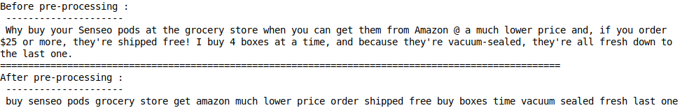

# Amazon Fine Food Reviews Analysis

The Amazon Fine Food Reviews dataset consists of reviews of fine foods from Amazon.<br>

Data Source : https://www.kaggle.com/snap/amazon-fine-food-reviews <br>


Number of reviews: 568,454<br>
Number of users: 256,059<br>
Number of products: 74,258<br>
Timespan: Oct 1999 - Oct 2012<br>
Number of Attributes/Columns in data: 10

## Objective

This project is focused to find the best model which can classify the class labels with high accuracy and less test error.
Here the source dataset consists of reviews of fine foods from amazon(kaggle).

## Install

This project requires Python 3.5 and the following Python packages and libraries installed:

    NumPy
    Pandas
    matplotlib
    scikit-learn
    seaborn
    string
    collections
    wordcloud
    gensim


You will also need to have software installed to run and execute an iPython Notebook

We recommend to install Anaconda, a pre-packaged Python distribution that contains all of the necessary libraries
and software for this project.

## Code

The code is provided in the Amazon Fine Food Reviews.ipynb notebook file. You also need the Reviews.csv dataset
file to run the Notebook. The dataset can be found on Kaggle.

## Data

The dataset contains 568,454 food reviews Amazon users left from October 1999 to October 2012.

## Features

    1. Id
    2. ProductId - unique identifier for the product
    3. UserId - unqiue identifier for the user
    4. ProfileName
    5. HelpfulnessNumerator - number of users who found the review helpful
    6. HelpfulnessDenominator - number of users who indicated whether they found the review helpful or not
    7. Score - rating between 1 and 5
    8. Time - timestamp for the review
    9. Summary - brief summary of the review
    10. Text - text of the review


## Target Variable

    Score: rating between 1 and 5
    Text : text of the review

## Steps to be followed

1. Preprocess data
2. Split data
3. Parameter Tuning
4. Feature Vectorization
5. Model Training
6. Model Testing
7. Observation

## [1.] Preprocessing Review Text

Now that we have finished deduplication our data requires some preprocessing before we go on further with analysis and
making the prediction model.

Hence in the Preprocessing phase we do the following in the order below:-

    1. Begin by removing the html tags
    2. Remove any punctuations or limited set of special characters like , or . or # etc.
    3. Check if the word is made up of english letters and is not alpha-numeric
    4. Check to see if the length of the word is greater than 2 (as it was researched that there is
        no adjective in 2-letters)
    5. Convert the word to lowercase
    6. Remove Stopwords
    7. Finally Snowball Stemming the word (it was obsereved to be better than Porter Stemming)<br>

After which we collect the words used to describe positive and negative reviews

```
# Combining all the above stundents
from tqdm import tqdm
preprocessed_reviews = []
# tqdm is for printing the status bar
# the loop below is pre-processing every sentence that we are considering for review analysis
for sentance in tqdm(final['Text'].values):

    # remove urls from text python
    sentance = re.sub(r"http\S+", "", sentance)

    # for removing html tags from text
    sentance = BeautifulSoup(sentance, 'lxml').get_text()

    # deconcatenation
    sentance = decontracted(sentance)

    #remove words with numbers python
    sentance = re.sub("\S*\d\S*", "", sentance).strip()

    #remove spacial character: https://stackoverflow.com/a/5843547/4084039
    sentance = re.sub('[^A-Za-z]+', ' ', sentance) # removes special characters

    # https://gist.github.com/sebleier/554280
    # to remove stop words from text
    sentance = ' '.join(e.lower() for e in sentance.split() if e.lower() not in stopwords)

    # storing each sentence in a list
    preprocessed_reviews.append(sentance.strip())
```

### [1.1] Deconcatenation

```
def decontracted(phrase):
    # specific
    phrase = re.sub(r"won't", "will not", phrase)
    phrase = re.sub(r"can\'t", "can not", phrase)

    # general
    phrase = re.sub(r"n\'t", " not", phrase)
    phrase = re.sub(r"\'re", " are", phrase)
    phrase = re.sub(r"\'s", " is", phrase)
    phrase = re.sub(r"\'d", " would", phrase)
    phrase = re.sub(r"\'ll", " will", phrase)
    phrase = re.sub(r"\'t", " not", phrase)
    phrase = re.sub(r"\'ve", " have", phrase)
    phrase = re.sub(r"\'m", " am", phrase)
    return phrase
```

### [1.2] Stopword Removal

```
stopwords= set([
    'br', 'the', 'i', 'me', 'my', 'myself', 'we', 'our', 'ours', 'ourselves', 'you', "you're",
    "you've", "you'll", "you'd", 'your', 'yours', 'yourself', 'yourselves', 'he', 'him', 'his',
    'himself', 'she', "she's", 'her', 'hers', 'herself', 'it', "it's", 'its', 'itself', 'they',
    'them', 'their', 'theirs', 'themselves', 'what', 'which', 'who', 'whom', 'this', 'that',
    "that'll", 'these', 'those', 'am', 'is', 'are', 'was', 'were', 'be', 'been', 'being', 'have',
    'has', 'had', 'having', 'do', 'does', 'did', 'doing', 'a', 'an', 'the', 'and', 'but', 'if',
    'or', 'because', 'as', 'until', 'while', 'of', 'at', 'by', 'for', 'with', 'about', 'against',
    'between', 'into', 'through', 'during', 'before', 'after', 'above', 'below', 'to', 'from',
    'up', 'down', 'in', 'out', 'on', 'off', 'over', 'under', 'again', 'further', 'then', 'once',
    'here', 'there', 'when', 'where', 'why', 'how', 'all', 'any', 'both', 'each', 'few', 'more',
    'most', 'other', 'some', 'such', 'only', 'own', 'same', 'so', 'than', 'too', 'very', 's', 't',
    'can', 'will', 'just', 'don', "don't", 'should', "should've", 'now', 'd', 'll', 'm', 'o', 're',
    've', 'y', 'ain', 'aren', "aren't", 'couldn', "couldn't", 'didn', "didn't", 'doesn', "doesn't",
    'hadn', "hadn't", 'hasn', "hasn't", 'haven', "haven't", 'isn', "isn't", 'ma', 'mightn',
    "mightn't", 'mustn', "mustn't", 'needn', "needn't", 'shan', "shan't", 'shouldn', "shouldn't",
    'wasn', "wasn't", 'weren', "weren't", 'won', "won't", 'wouldn', "wouldn't"
    ])
```




##[2.] Spliting data into Train, CrossValidation and Test

```
"""
Spliting sample data into :- [train:cross validation:test]
"""
x_train = pd.Series(preprocessed_reviews[:70000])
x_cv = pd.Series(preprocessed_reviews[70000:80000])
x_test = pd.Series(preprocessed_reviews[80000:100000])
y_train = final['Score'][:70000]
y_cv = final['Score'][70000:80000]
y_test = final['Score'][80000:100000]
```

##[3.] Feature Vectorization
* Bag of words
* TF IDF
* Average Word to Vector
* TF IDF Word to Vector

##[4.] Parameter Tuning


##[5.] Model Training
Below function trains model, finds train accuracy and AUC score and print confusion matrix.
In this function I have used Random Frest alogorithm.

```
def train_random_forest(x_train, y_train, optimal_estimator, depth):
    model = RandomForestClassifier(n_estimators= optimal_estimator, max_depth = depth, n_jobs=-1)
    model.fit(x_train, y_train)

    # response prediction
    pred = model.predict(x_train)

    # evaluate accuracy
    acc = accuracy_score(y_train, pred)*100
    print("Accuracy : %.2f"%(acc))

    # prediction probability for auc_score
    pred_prob = model.predict_proba(x_train)[:,1]
    auc_score = auc(y_train, pred_prob, reorder= True)
    print("AUC Score for positive lable:", auc_score)

    conf_matrix = confusion_matrix(y_train, pred)
    confusion_matrix_df = pd.DataFrame(conf_matrix,
                                       ["Negative", "Positive"],\
                                       ["Negative", "Positive"],\
                                       dtype=int)
    sns.heatmap(confusion_matrix_df, annot=True, fmt="d")
    plt.title("CONFUSION MATRIX")
    return model
```
code snippet calling above fuction to train the model

```
    model = train_random_forest(bow_text_train_vector, y_train, 1000, 100)
```
    

##[6.] Model Testing
Below code snippet test the models, finds test accuracy and AUC score and print confusion matrix.

```
def test_random_forest(model, x_test, y_test):
    pred = model.predict(x_test)
    # evaluate accuracy
    acc = accuracy_score(y_test, pred)*100
    print("Accuracy : %.2f"%(acc))

    # predict probabilities for auc_score
    pred_prob = model.predict_proba(x_test)[:,1]
    auc_score = auc(y_test, pred_prob, reorder= True)
    print("AUC Score for positive lable:", auc_score)

    conf_matrix = confusion_matrix(y_test, pred)
    confusion_matrix_df = pd.DataFrame(conf_matrix,
                                       ["Negative", "Positive"],\
                                       ["Negative", "Positive"],\
                                       dtype=int)
    sns.heatmap(confusion_matrix_df, annot=True, fmt="d")
    plt.title("CONFUSION MATRIX")
```
calling the above fuction to get test scores.

```
test_random_forest(model, bow_text_test_vector, y_test)
```


### Top 20 important words of amazon food review
Below code snippet will snow top 20 words that more value to our model.

```
features = count_vect.get_feature_names()
text = ""
for i in np.flip(np.argsort(model.feature_importances_))[:20]:
    text = text + features[i] + " "
wordcloud = WordCloud(max_font_size=50,background_color="white").generate(text)
plt.figure(figsize=(12, 10))
plt.title("Word Cloud of top 20 words.", fontsize=20)
plt.imshow(wordcloud, interpolation="bilinear")
plt.axis("off")
plt.show()
```


##[7.] Observation
By applying all the featurized data to model traing andd testing, I got below results.


